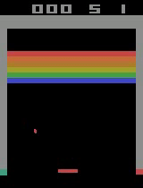
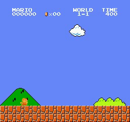

# PPO

[](http://makeapullrequest.com)  

Implementation of the proximal policy optimization on Atari environments. All hyper-parameters have been chosen based on the paper.
> For continuous domain (Mujoco) [look at this](https://github.com/alirezakazemipour/Mujoco-PPO).

## Dependencies
- gym == 0.17.2  
- numpy == 1.19.1  
- opencv_contrib_python == 3.4.0.12  
- torch == 1.4.0  
- tqdm == 4.47.0  

## Installation
```shell
pip3 install -r requirements.txt
```

## Usage
The training requires a suitable (not necessarily a 1080 Ti or a 2080 RTX Nvidia gpu :grin:) gpu-enabled machine. Google Colab provides what is enough to train such an algorithm but if you a more powerful free online gpu provider, take a look at: [paperspace.com](paperspace.co).  
- **To run the code**:  
```shell
python3 main.py
```
- **If you want continue the previous training procedure, turn `LOAD_FROM_CKP` to `True` otherwise, the training would be restarted from scratch**.  
- **If you want to test the agent, simply turn `Train` flag to `False`**. There is a pre-trained model in the _Pre-trained models_ directory that you may use to see agent plays.  

## Environments tested
- [x] Pong
- [x] Breakout 
- [ ] SuperMarioBros-1-1
- [ ] MsPacman

## Demo
Breakout | Mario
:-------------:|:---------:
| 

## Result
- **Following graphs are breakout environment's result**.  
<p align="center">
  
</p>  

## Reference
[_Proximal Policy Optimization Algorithms_, Schulman et al., 2017](https://arxiv.org/abs/1707.06347)

## Acknowledgement
[@OpenAI](https://github.com/openai) for [Baselines](https://github.com/openai/baselines).  
[@higgsfield](https://github.com/higgsfield) for [his ppo code](https://github.com/higgsfield/RL-Adventure-2/blob/master/3.ppo.ipynb).
